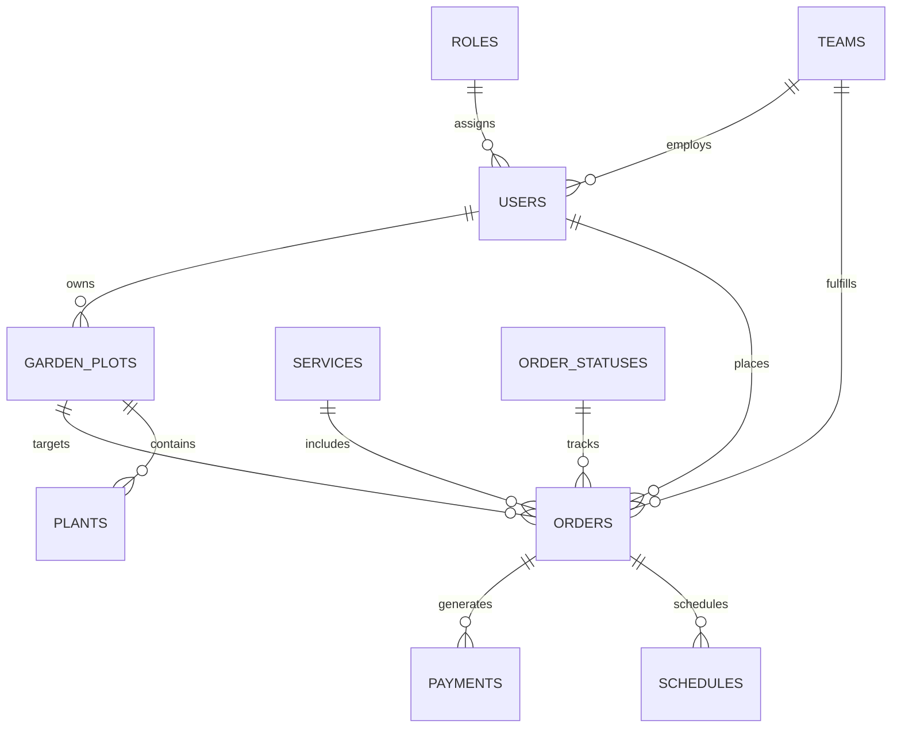

# 🌿 Gardening Services Management Platform


A full-stack **gardening services operations platform** that connects clients, field crews (foremen), and managers in one workflow—from catalog browsing and plot management to order fulfillment, scheduling, and team payouts.

Built as a portfolio backend project demonstrating production-oriented API design, secure authentication, role-based authorization, and pragmatic database access patterns.

---

## 📖 Project Description

Landscaping and gardening companies need more than a static website: they need to coordinate **who** requests a service, **which crew** executes it, and **how managers** assign work and track revenue.

This platform delivers that operational layer:

| Stakeholder | Business value |
|-------------|----------------|
| **Client** | Register plots, browse services, place and track orders |
| **Foreman (Team)** | View assigned jobs, update execution status, monitor team earnings |
| **Manager** | Manage service catalog, assign teams, schedule work, approve payments |

The backend is the system of record: REST APIs, PostgreSQL persistence, and auto-generated OpenAPI docs. The React frontend provides role-specific dashboards on top of the same API.

---

## ✨ Core Features

### 🔐 Role-Based Access Control (RBAC)

Three distinct roles drive authorization across every protected route:

| Role | Code name | Capabilities |
|------|-----------|--------------|
| **Client** | `Клієнт` | Profile, garden plots, plants, order history, create/cancel orders |
| **Foreman** | `Бригада` | Team task board, order status updates, financial summaries |
| **Manager** | `Менеджер` | Service CRUD, order assignment, schedules, team workload, payments |

Access is enforced server-side via FastAPI dependencies (`get_current_user`, `get_current_manager`, `get_current_team`)—the API never relies on the UI alone for security.

### 🛡️ Stateless JWT Authentication & Authorization

- **JWT** signed with `HS256` and a configurable `SECRET_KEY`
- Tokens delivered as **HttpOnly cookies** (mitigates XSS token theft)
- `SameSite` cookie flags for CSRF hardening
- Passwords hashed with **bcrypt** via Passlib
- Registration defaults new users to the **Client** role

### ⚡ Optimized Database Queries

The data layer balances **SQLAlchemy 2.0 ORM** with targeted query patterns:

- **`select()` + `db.execute()`** for lean, explicit reads (preferred over legacy Query API)
- **`joinedload()`** on order endpoints to avoid N+1 queries when loading users, plots, services, statuses, schedules, and payments in one round trip
- **`func.sum()` / `func.count()`** aggregations for foreman finance dashboards (earnings, completed jobs, pending payouts)
- **`cast(..., Date)`** and joins for manager workload calculations per team and day

Complex reads stay in SQLAlchemy Core/ORM expressiveness; hot paths avoid redundant round trips to PostgreSQL.

### 📚 Auto-Generated API Documentation

FastAPI exposes interactive **Swagger UI** and **ReDoc** from the OpenAPI schema—no manual sync between code and docs.

### 🐳 Containerized Runtime

**Docker Compose** orchestrates a multi-container stack:

- `api` — FastAPI application (migrations on startup)
- `db` — PostgreSQL 16 with persistent volume

One command builds images, applies Alembic migrations, and starts the API on port `8000`.

---

## 🧰 Tech Stack

| Layer | Technologies |
|-------|----------------|
| **Backend** | Python 3.10+, FastAPI, Uvicorn, SQLAlchemy 2.0, Alembic, Pydantic |
| **Database** | PostgreSQL 16 |
| **Auth** | python-jose (JWT), Passlib/bcrypt, HttpOnly cookies |
| **Frontend** | React 19, Vite 8, React Router 7 |
| **DevOps** | Docker, Docker Compose |
| **Tooling** | ESLint, Alembic migrations |

---

## 🗄️ Database Schema

PostgreSQL stores the domain model. Key entities and relationships:



### Core tables

| Entity | Purpose | Key fields |
|--------|---------|------------|
| **Users** | Accounts for all roles | `email`, `password_hash`, `role_id`, optional `team_id` |
| **Roles** | RBAC definitions | `name` — Client, Manager, Foreman (Team) |
| **Services** | Service catalog | `name`, `description`, `price`, `category`, `image_url` |
| **Orders** | Work requests | `user_id`, `service_id`, `plot_id`, `team_id`, `status_id`, `total_price`, `execution_date` |
| **GardenPlots** | Client properties | `address`, `area`, `features`, `user_id` |
| **Teams** | Field crews | `name`, `leader_id`, `efficiency_rating` |
| **OrderStatuses** | Workflow states | e.g. pending, in progress, completed |
| **Schedules** | Manager planning | `order_id`, `scheduled_time` |
| **Payments** | Crew compensation | `order_id`, `team_id`, `amount`, `status` |
| **Plants** | Plot inventory | `plant_type`, `plot_id` |

Schema changes are versioned with **Alembic** under `backend/alembic/versions/`.

---

## 🚀 Getting Started

### Prerequisites

- [Git](https://git-scm.com/)
- [Docker](https://www.docker.com/) & [Docker Compose](https://docs.docker.com/compose/) v2+
- **Python 3.10+** (optional, for local development without Docker)
- **Node.js 18+** (optional, for running the React frontend locally)

### 1. Clone the repository

```bash
git clone https://github.com/<your-username>/gardening-info-system.git
cd gardening-info-system
```

### 2. Configure environment variables

Copy the example env file and adjust secrets for your environment:

```bash
cp .env.example .env
```

Edit `.env` — at minimum set a strong `SECRET_KEY`:

```env
POSTGRES_USER=garden_user
POSTGRES_PASSWORD=garden_secret
POSTGRES_DB=garden_db
DATABASE_URL=postgresql://garden_user:garden_secret@db:5432/garden_db
SECRET_KEY=your-long-random-secret-key
ALGORITHM=HS256
ACCESS_TOKEN_EXPIRE_MINUTES=1440
```

> **Production:** set `COOKIE_SECURE=true` and serve the API over HTTPS.

### 3. Run with Docker Compose

From the project root:

```bash
docker-compose up --build
```

| Service | URL |
|---------|-----|
| API | http://localhost:8000 |
| Swagger UI | http://localhost:8000/docs |
| ReDoc | http://localhost:8000/redoc |
| PostgreSQL | `localhost:5432` |

On first boot, the API container runs `alembic upgrade head` before starting Uvicorn.

#### Seed roles & manager (first run)

After migrations, insert baseline roles (`Клієнт`, `Менеджер`, `Бригада`) and optional manager account:

```bash
docker-compose exec api python init_manager.py
```

### 4. Run the frontend (optional)

```bash
cd frontend
npm install
# Create frontend/.env.local with: VITE_API_URL=http://localhost:8000
npm run dev
```

Frontend dev server: **http://localhost:5173**

### Local backend (without Docker)

```bash
cd backend
python -m venv .venv
source .venv/bin/activate          # Windows: .venv\Scripts\activate
pip install -r requirements.txt
cp ../.env.example .env            # point DATABASE_URL to your PostgreSQL instance
alembic upgrade head
uvicorn app.server:app --reload --host 0.0.0.0 --port 8000
```

---

## 📘 API Documentation

FastAPI generates OpenAPI 3 metadata automatically from route signatures, Pydantic schemas, and dependency injection.

| Resource | URL |
|----------|-----|
| **Swagger UI** (try endpoints) | http://localhost:8000/docs |
| **ReDoc** (readable reference) | http://localhost:8000/redoc |
| **OpenAPI JSON** | http://localhost:8000/openapi.json |

### Route groups

| Prefix | Tag | Description |
|--------|-----|-------------|
| `/auth` | Authentication | Register, login, logout (JWT cookie) |
| `/profile` | Profile | User profile, plots, plants, order history |
| `/orders` | Orders | Catalog, CRUD, status updates |
| `/manager` | Manager | Services, orders, schedules, workload, payments |
| `/teams` | Teams | Crew tasks, finance aggregates |

Authenticated requests must include credentials: the browser sends the `access_token` HttpOnly cookie after login (`credentials: 'include'` on the frontend).

---

## 🏗️ Architecture & Directory Structure

```
gardening-info-system/
├── docker-compose.yml          # Multi-container orchestration (API + PostgreSQL)
├── .env.example                # Environment variable template
│
├── backend/
│   ├── Dockerfile
│   ├── requirements.txt
│   ├── alembic/                # Database migrations
│   │   └── versions/
│   ├── init_manager.py         # Seed manager user
│   ├── images/                 # Uploaded service images (static mount)
│   └── app/
│       ├── server.py           # FastAPI app, CORS, routers, static files
│       ├── routers/            # HTTP layer (auth, profile, order, manager, team)
│       ├── models/             # SQLAlchemy ORM entities
│       ├── schemas/            # Pydantic request/response models
│       └── utils/
│           ├── database.py     # Engine, session, get_db
│           ├── security.py     # JWT cookie auth + RBAC dependencies
│           └── generator_jwt.py
│
└── frontend/
    ├── src/
    │   ├── pages/              # Auth, Main, Profile, Manager, Team, CreateOrder
    │   ├── components/       # Role-specific UI (manager, profile, order, team)
    │   ├── contexts/           # AuthContext (session state)
    │   ├── services/           # API client (config, api.js)
    │   └── hooks/              # useAuth
    ├── package.json
    └── vite.config.js
```

### Request flow

```
Client (React)  →  HTTP + HttpOnly Cookie  →  FastAPI Router
                                              ↓
                                    security.py (JWT + RBAC)
                                              ↓
                                    SQLAlchemy Session  →  PostgreSQL
```

---

## 👤 Author

**Junior Backend Developer** — portfolio project showcasing API design, PostgreSQL modeling, JWT/RBAC security, and containerized deployment.

---

## 📄 License

This project is licensed under the **MIT License**.
